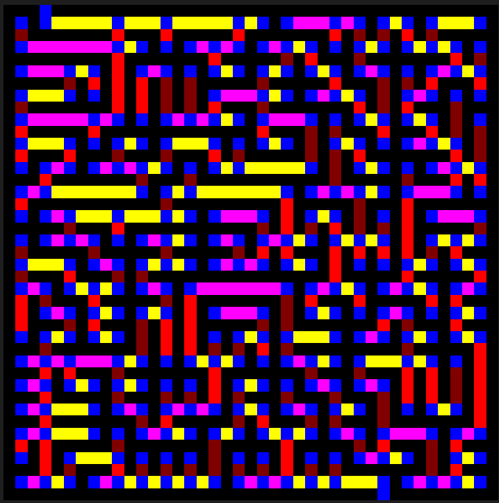

# Graphs in rust!!!!

Just finished a cool maze image to graph algorithm.

The blue squares are nodes, and all the other colors are edges. Yellow edges go right, red is down, magenta is left, and red is up.

Right now this new algorithm is about 3x slower than the first one at generating the maze.
